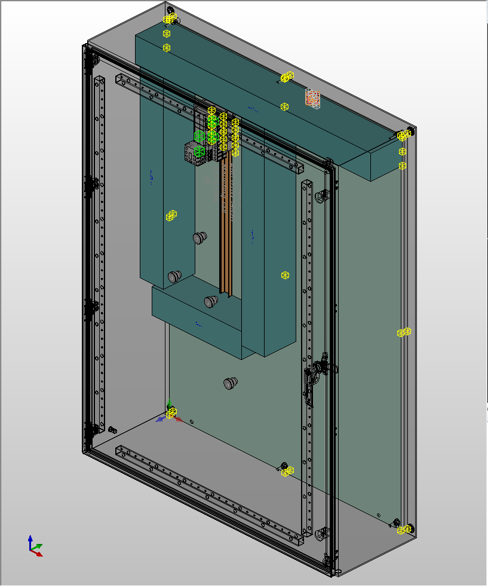

# xeokit-EPLANLoader

I work on a [EPLAN ](https://www.eplan.de/) plugin loader WIP, I know that Xeogl is build for BIM, but it is really good as MCAD viewer.

**ToDo**

- [x] VRML Parser
- [ ] Performance model?
- [ ] WRI Parser for metadata (Eplan export data in a false CSV file)
- [ ] Option for WRI parser (DT vs Full DT)

Result for now :

# To use:

1. Copy the folder [VRMLLoaderPlugin](https://github.com/nicrf/xeokit-EPLANLoader/tree/master/VRMLLoaderPlugin) to folder src\viewer\plugins of [Xeokit](https://github.com/xeokit/xeokit-sdk).
2. Copy the example file [loading_VRML_Eplan.html](https://github.com/nicrf/xeokit-EPLANLoader/blob/master/loading_VRML_Eplan.html) to examples folder of [Xeokit](https://github.com/xeokit/xeokit-sdk).
3. Upload your model or use this [demo model.](https://github.com/nicrf/babylonejsVRMLLoader/blob/master/small.wrl) or the demo.wrl and wri file.
4. Edit the line 108 & 109 of [loading_VRML_Eplan.html](https://github.com/nicrf/xeokit-EPLANLoader/blob/master/loading_VRML_Eplan.html)  with the name of your model.

Demo from EPLAN :

